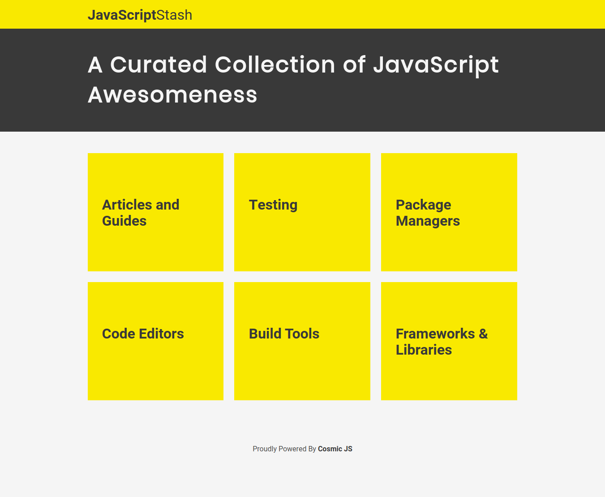

# cosmic-stash


> A content curation app built with Vue and Cosmic JS

> [Check out the live demo hosted on Cosmic JS hosting](http://cosmic-stash.cosmicapp.co)

## Build Setup

``` bash
# install dependencies
npm install

# configure environment variables
copy and rename .env.sample to .env and fill in cosmic bucket configuration

# serve with hot reload at localhost:8080
npm run dev

# build for production with minification
npm run build

# build for production and view the bundle analyzer report
npm run build --report
```
